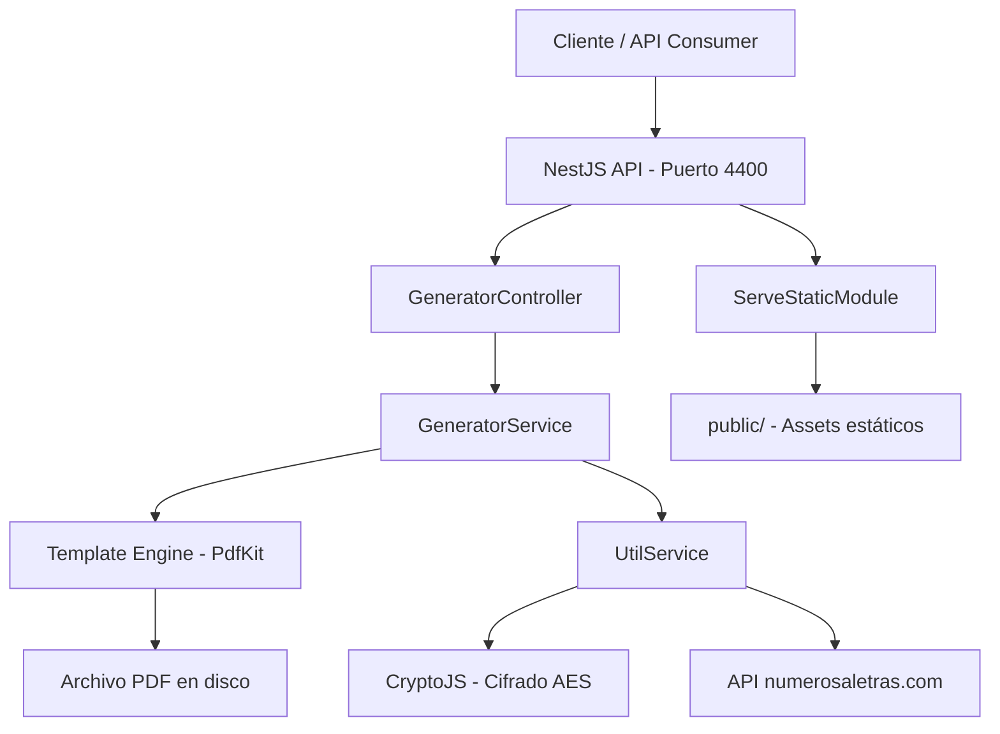
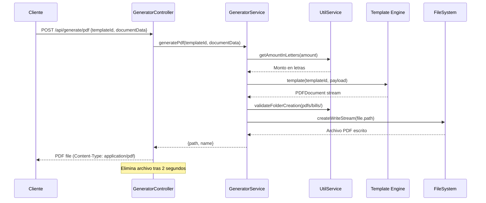
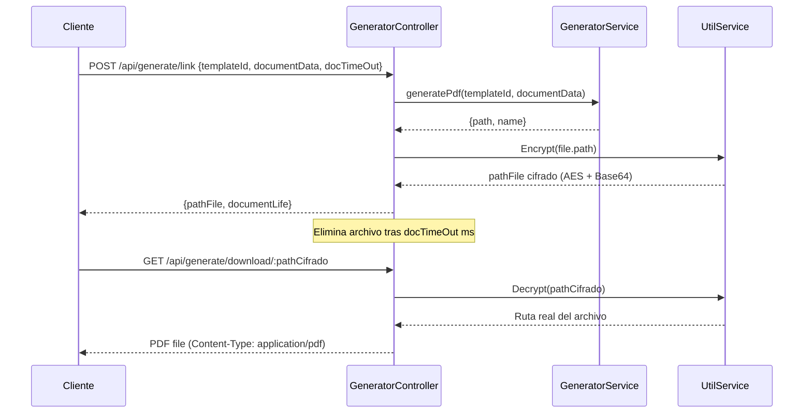

# Architecture — DocForge

## Visión General

DocForge es un microservicio monolítico construido con NestJS que genera documentos PDF a partir de templates PdfKit parametrizados. La arquitectura sigue el patrón modular de NestJS, separando responsabilidades entre controladores, servicios, DTOs y templates.

El flujo principal recibe un payload JSON con los datos del documento y un identificador de template, genera el PDF en disco usando PdfKit, y lo retorna como descarga directa o como un enlace temporal cifrado con AES. Los archivos generados son efímeros y se eliminan automáticamente después de un tiempo configurable.

## Componentes Principales

### GeneratorController

- **Responsabilidad:** Expone los 3 endpoints REST para generación y descarga de PDFs. Maneja la validación de entrada con DTOs y la limpieza de archivos temporales.
- **Tecnología:** NestJS Controller con decoradores `@Post` y `@Get`
- **Puerto/URL:** `http://localhost:4400/api/generate/`

### GeneratorService

- **Responsabilidad:** Orquesta la generación del PDF: invoca el template correspondiente al `templateId`, crea el directorio de salida si no existe, escribe el archivo PDF en disco y retorna la referencia al archivo generado.
- **Tecnología:** NestJS Injectable Service + PdfKit

### Template Engine (PdfKit Templates)

- **Responsabilidad:** Define la estructura visual de cada tipo de documento PDF. Cada template es una función exportada que recibe un payload y retorna un objeto `PDFDocument` de PdfKit con el contenido renderizado.
- **Tecnología:** PdfKit con templates registrados: `t0000002198` (cuenta de cobro), `t0000002199` (recibo de pago), `t0000002000` (constancia)
- **Ubicación:** `src/shared/templates/pdfkit/`

### UtilService

- **Responsabilidad:** Funciones utilitarias transversales: gestión de rutas de archivos, creación de directorios, cifrado/descifrado AES de rutas de descarga, y conversión de montos numéricos a texto mediante API externa.
- **Tecnología:** CryptoJS (AES), Axios, Node.js `fs` y `path`

### ServeStaticModule

- **Responsabilidad:** Sirve los archivos estáticos (imágenes de header, footer, firma, fuentes) desde el directorio `public/` que son referenciados por los templates durante la generación del PDF.
- **Tecnología:** `@nestjs/serve-static`
- **Puerto/URL:** `http://localhost:4400/` (archivos estáticos)

## Flujos Críticos

### Generación de PDF directo

### Generación de link temporal cifrado

## Decisiones Técnicas

| Decisión | Alternativas Evaluadas | Razón |
|---|---|---|
| PdfKit como motor de renderizado PDF | Puppeteer, jsPDF, pdfmake | PdfKit ofrece control programático granular del layout sin depender de un navegador headless. Menor consumo de recursos en servidor |
| Templates como funciones exportadas | Motor de templates HTML, archivos JSON de configuración | Permite control total del documento PDF con lógica TypeScript nativa, sin capas de abstracción intermedias |
| Archivos PDF efímeros en disco | Almacenamiento en memoria, upload a S3 | Simplicidad operativa. Los PDFs se generan, se sirven y se eliminan automáticamente. No requiere infraestructura de almacenamiento adicional |
| CryptoJS AES para enlaces de descarga | JWT, tokens de sesión | Permite cifrar la ruta del archivo directamente en el enlace, eliminando la necesidad de una base de datos para mapear tokens a archivos |
| CapRover + Docker multi-stage | Kubernetes, deploy manual | CapRover simplifica el deploy con un solo push. Docker multi-stage optimiza el tamaño de la imagen de producción |

## Dependencias Externas

| Servicio | Propósito | SLA/Criticidad |
|---|---|---|
| numerosaletras.com | Conversión de montos numéricos a texto en español (ej: "CIEN MIL PESOS") | Media — si falla, la generación de PDF con montos en letras se interrumpe |
| Imágenes en `public/img/` | Headers, footers y firmas digitales embebidas en los PDFs | Alta — sin estas imágenes los templates fallan con `ENOENT` |
