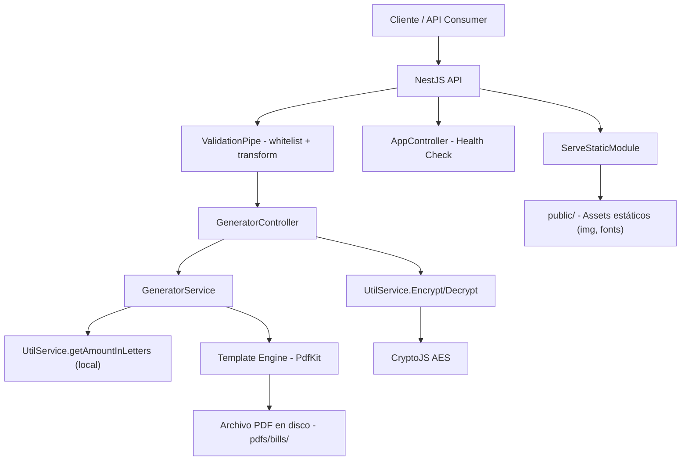
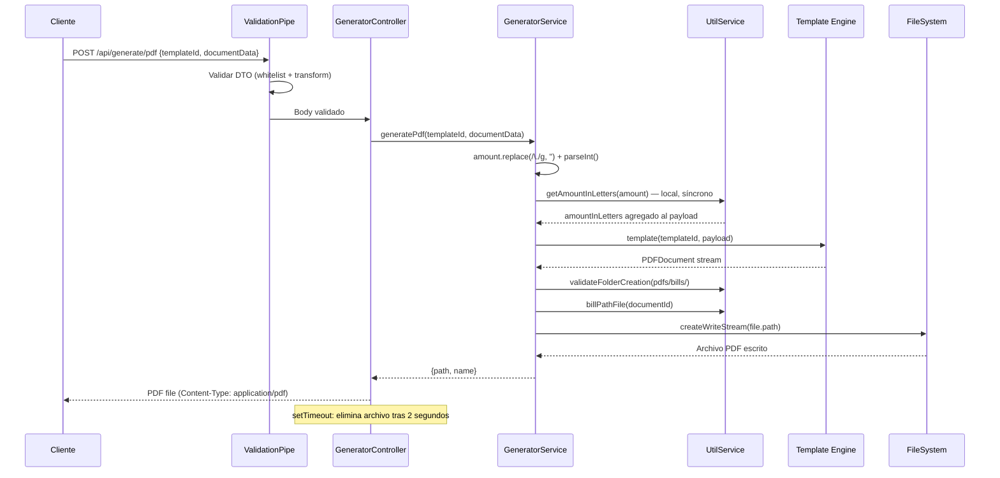
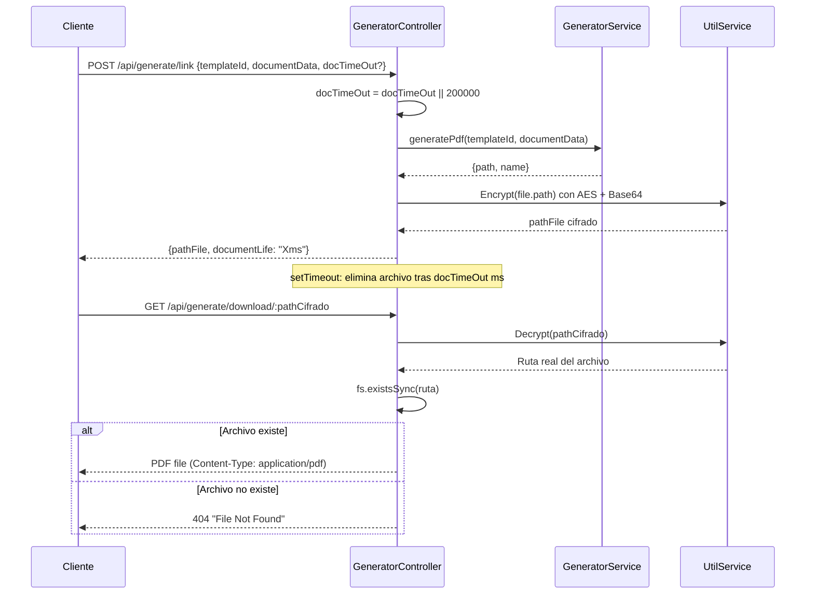

# Architecture — DocForge

## Visión General

DocForge es un microservicio monolítico construido con NestJS 9 que genera documentos PDF a partir de templates PdfKit parametrizados. La arquitectura sigue el patrón modular de NestJS, separando responsabilidades entre controladores, servicios, DTOs y templates.

El flujo principal recibe un payload JSON con los datos del documento y un identificador de template, convierte montos a texto con una función local, genera el PDF en disco usando PdfKit, y lo retorna como descarga directa o como un enlace temporal cifrado con AES. Los archivos generados son efímeros y se eliminan automáticamente después de un tiempo configurable. El servicio no usa base de datos ni depende de APIs externas.

## Componentes Principales

### AppController + AppService

- **Responsabilidad:** Health check del servicio. `GET /` retorna `"Hello World!"` para verificar que el servicio está activo.
- **Tecnología:** NestJS Controller + Injectable Service
- **Puerto/URL:** `http://localhost:{PORT}/`

### GeneratorController

- **Responsabilidad:** Expone los 3 endpoints REST para generación y descarga de PDFs. Maneja la respuesta HTTP, el envío del archivo PDF, y la limpieza de archivos temporales con `setTimeout`.
- **Tecnología:** NestJS Controller con decoradores `@Post('pdf')`, `@Post('link')`, `@Get('download/:path')`
- **Puerto/URL:** `http://localhost:{PORT}/api/generate/`
- **Endpoints:** `POST /api/generate/pdf`, `POST /api/generate/link`, `GET /api/generate/download/:path`

### GeneratorService

- **Responsabilidad:** Orquesta la generación del PDF: primero invoca `UtilService.getAmountInLetters()` (función local síncrona) para convertir el monto a texto, luego invoca el template correspondiente al `templateId`, crea el directorio `pdfs/bills/` si no existe, escribe el archivo PDF en disco y retorna la referencia `{ path, name }`.
- **Tecnología:** NestJS Injectable Service + PdfKit
- **Detalle:** Procesa `payload.amount.replace(/\./g, '')` para eliminar todos los separadores de miles antes de convertir a número.

### Template Engine (PdfKit Templates)

- **Responsabilidad:** Define la estructura visual de cada tipo de documento PDF. Cada template es una función exportada que recibe un payload y retorna un objeto `PDFDocument` de PdfKit con el contenido renderizado.
- **Tecnología:** PdfKit con fuente Courier (built-in), tamaño de página LETTER, buffered pages habilitado
- **Templates registrados:**
  - `t0000002198` — Cuenta de cobro legacy (usa `table_accounts.png`)
  - `t0000002199` — Recibo de pago legacy (usa `firma_carlosm.png`)
  - `t0000002000` — Constancia legacy (usa `firma_carlosm.png`; secciones de título, cliente y monto están desactivadas)
  - `t0000003000` — Voucher de producción Ordamy (sin imágenes, solo texto)
  - `t0000003001` — Cuenta de cobro Ordamy (sin imágenes, con datos monetarios)
  - `t0000003002` — Corte diario Ordamy (resumen financiero diario con detalle de pagos y egresos)
  - `t0000003003` — Corte mensual Ordamy (resumen financiero mensual con egresos por categoría)
- **Ubicación:** `src/shared/templates/pdfkit/`
- **Lineamientos:** `src/shared/templates/TEMPLATE_GUIDELINES.md` documenta el sistema visual para templates nuevos
- **Dispatch:** `src/shared/templates/index.ts` mapea `templateId` a la función exportada: `alltemplates[templateId](payload)`

### UtilService

- **Responsabilidad:** Funciones utilitarias transversales:
  - Gestión de rutas de archivos (`generatePathFile`, `generatePathFolder`, `billPathFolder`, `billPathFile`)
  - Creación de directorios (`validateFolderCreation` con `recursive: true`)
  - Cifrado/descifrado AES de rutas de descarga (`Encrypt`/`Decrypt`)
  - Conversión de montos numéricos a texto en español (`getAmountInLetters`) — función local síncrona, soporta unidades hasta billones
- **Tecnología:** CryptoJS (AES), Node.js `fs` y `path`

### ConfigModule

- **Responsabilidad:** Carga las variables de entorno definidas en `.env` a `process.env`
- **Tecnología:** `@nestjs/config` con `ConfigModule.forRoot()` (sin validación de esquema)

### ServeStaticModule

- **Responsabilidad:** Sirve los archivos estáticos (imágenes y fuentes) desde el directorio `public/` que son referenciados por los templates durante la generación del PDF.
- **Tecnología:** `@nestjs/serve-static` con `rootPath: join(__dirname, '..', 'public')`
- **Puerto/URL:** `http://localhost:{PORT}/` (archivos estáticos en la raíz)

### ValidationPipe (Global)

- **Responsabilidad:** Valida todos los requests entrantes contra los DTOs con `class-validator`. Configurado globalmente en `main.ts`.
- **Opciones:** `whitelist: true` (campos extra se eliminan silenciosamente), `transform: true` (conversión automática de tipos)
- **DTO principal:** `createDocumentDTO` valida `templateId` (string, no vacío), `docTimeOut` (número, opcional), `documentData` (objeto, no vacío)

## Flujos Críticos

### Generación de PDF directo

### Generación de link temporal cifrado

## Decisiones Técnicas

| Decisión | Alternativas Evaluadas | Razón |
|---|---|---|
| PdfKit como motor de renderizado PDF | Puppeteer, jsPDF, pdfmake (prototipada — queda como dependencia en `package.json` con código comentado en `src/assets/`) | PdfKit ofrece control programático granular del layout sin depender de un navegador headless. Menor consumo de recursos en servidor |
| Templates como funciones TypeScript exportadas | Motor de templates HTML, archivos JSON de configuración | Permite control total del documento PDF con lógica TypeScript nativa, sin capas de abstracción intermedias |
| Archivos PDF efímeros en disco | Almacenamiento en memoria, upload a S3 | Simplicidad operativa. Los PDFs se generan, se sirven y se eliminan automáticamente. No requiere infraestructura de almacenamiento adicional |
| CryptoJS AES para enlaces de descarga | JWT, tokens de sesión | Permite cifrar la ruta del archivo directamente en el enlace, eliminando la necesidad de una base de datos para mapear tokens a archivos |
| CapRover + Docker multi-stage | Kubernetes, deploy manual | CapRover simplifica el deploy con un solo push. Docker multi-stage optimiza el tamaño de la imagen de producción |
| Conversión local de montos a texto | API externa (numerosaletras.com — reemplazada) | Eliminada la dependencia externa que bloqueaba la generación de PDF cuando la API no respondía. Implementación local síncrona sin dependencia de red |
| Templates Ordamy sin imágenes | Reutilizar imágenes PNG de templates legacy | Los templates `t0000003XXX` usan solo primitivas de PdfKit (rectángulos, líneas, texto) para mejor portabilidad y rendimiento en impresión |

## Dependencias Externas

| Servicio | Propósito | SLA/Criticidad |
|---|---|---|
| Imágenes en `public/img/` | Assets embebidos en los PDFs legacy (`t0000002XXX`): `header.png`, `footer.png`, `firma_carlosm.png`, `table_accounts.png` | **Alta** — sin estas imágenes los templates legacy fallan con `ENOENT`. Los templates Ordamy (`t0000003XXX`) no dependen de imágenes |
