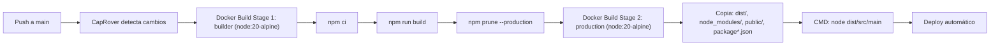

# Operations — DocForge

## Deploy

### Pipeline CI/CD

DocForge se despliega mediante CapRover, que construye la imagen Docker automáticamente al hacer push al repositorio conectado. El proyecto incluye un archivo `captain-definition` (con `schemaVersion: 2`) que apunta al `Dockerfile` en la raíz. El Dockerfile usa un build multi-stage con `node:20-alpine`.



**Detalle del Dockerfile multi-stage:**

- **Stage 1 (builder):** Instala dependencias con `npm ci`, compila TypeScript con `npm run build`, y ejecuta `npm prune --production` para eliminar devDependencies.
- **Stage 2 (production):** Copia solo los artefactos necesarios del builder: `package*.json`, `node_modules/`, `dist/`, y `public/`. Ejecuta `node dist/src/main`.
- El directorio `client/` y `src/` NO se copian al contenedor de producción.
- Los archivos Poppins TTF en `src/assets/fonts/` se compilan al `dist/` pero no son usados por los templates (usan Courier built-in de PdfKit).

### Deploy Manual

Si necesitas desplegar manualmente sin CapRover, puedes construir y ejecutar la imagen Docker directamente:

```sh
# Construir la imagen
docker build -t docforge:latest .

# Ejecutar el contenedor
docker run -d \
  --name docforge \
  -p 4400:3000 \
  -e PORT=3000 \
  -e CRYPTO_KEY=<tu_clave_secreta> \
  docforge:latest
```

Para deploy sin Docker:

```sh
npm install
npm run build
PORT=3000 CRYPTO_KEY=<tu_clave_secreta> node dist/src/main
```

El script `start:prod` en `package.json` está definido como `node dist/main`, pero la ruta real del entry point compilado es `dist/src/main` (como se confirma en el Dockerfile). Usar directamente `node dist/src/main` para evitar errores.

## Variables de Entorno

| Variable | Requerida | Descripción | Ejemplo |
|---|---|---|---|
| `PORT` | ❌ | Puerto TCP en el que escucha el servicio HTTP. Actualmente hardcodeado a `3000` en `main.ts` | `3000` |
| `CRYPTO_KEY` | ✅ | Clave secreta para cifrado/descifrado AES de rutas de archivos PDF temporales. Sin esta variable, el endpoint `/api/generate/link` falla | `MiClaveSecretaSegura2026` |
| `NODE_ENV` | ❌ | Entorno de ejecución. El Dockerfile lo establece como `build` en stage 1 y `production` en stage 2 | `production` |

El archivo `.env.example` del repositorio está vacío. Las variables deben configurarse manualmente en `.env` o como variables de entorno del sistema/contenedor.

## Monitoreo

| Métrica | Dashboard | Umbral de Alerta |
|---|---|---|
| Uso de disco en `pdfs/bills/` | Monitoreo del host / CapRover | Alertar si el directorio supera 500 MB (indica que la limpieza automática de archivos no está funcionando) |
| Tiempo de respuesta de `/api/generate/pdf` | Logs del servidor / CapRover | Alertar si supera 5 segundos (puede indicar carga excesiva o problemas de disco) |
| Disponibilidad del servicio | CapRover health check | Alertar si `GET /` no responde con 200 OK y texto `Hello World!` |
| Conectividad del servicio | Monitoreo de red | Alertar si el contenedor no puede resolver DNS o alcanzar dependencias internas |

## Alertas

| Alerta | Severidad | Causa Probable | Acción |
|---|---|---|---|
| Servicio no responde en el puerto configurado | Alta | El contenedor se detuvo o el proceso Node.js crasheó | Verificar logs: `docker logs docforge`. Reiniciar: `docker restart docforge` o re-deploy desde CapRover |
| Error ENOENT en generación de PDF | Alta | Faltan imágenes en `public/img/` (solo afecta templates legacy `t0000002XXX`). Los templates Ordamy `t0000003XXX` no usan imágenes | Verificar que `public/` se copió correctamente en el build Docker |
| Acumulación de archivos PDF en disco | Media | El `setTimeout` para eliminación de archivos no se ejecutó (proceso reiniciado antes del timeout) | Limpiar manualmente `pdfs/bills/` dentro del contenedor y reiniciar el servicio |
| Error `Cannot read properties of undefined` | Media | Un request llegó sin campo `amount` en `documentData` | Revisar la integración del cliente consumidor para que siempre envíe `amount` |

## Rollback

```sh
# 1. Identificar la versión anterior en CapRover
#    Ir a CapRover > Apps > docforge > Deployment

# 2. Si se usa Docker directamente, reconstruir con el commit anterior
git checkout <commit-anterior>
docker build -t docforge:rollback .

# 3. Detener el contenedor actual
docker stop docforge
docker rm docforge

# 4. Levantar la versión anterior (usar la misma CRYPTO_KEY para que los links existentes sigan funcionando)
docker run -d \
  --name docforge \
  -p 4400:3000 \
  -e PORT=3000 \
  -e CRYPTO_KEY=<misma_clave> \
  docforge:rollback

# 5. Verificar que el servicio responde
curl http://localhost:4400

# 6. Verificar generación de PDF
curl -X POST http://localhost:4400/api/generate/pdf \
  -H "Content-Type: application/json" \
  -d '{"templateId":"t0000002199","documentData":{"documentId":"ROLLBACK-TEST","date":"test","client":{"name":"Test","docType":"CC","docNumber":"123"},"creditor":{"name":"Test","docType":"CC","docNumber":"456"},"amount":"1000","items":[{"description":"Test"}],"signature":"test"}}' \
  --output rollback-test.pdf
```

## Incidentes Comunes

| Incidente | Síntoma | Runbook |
|---|---|---|
| PDFs no se generan | El endpoint `/api/generate/pdf` retorna 400 con mensaje de error | 1. Revisar logs del contenedor. 2. Si dice `Cannot read properties of undefined (reading 'replace')`: falta `amount` en el payload. 3. Si dice `is not a function`: templateId inválido. 4. Si hay timeout: verificar conectividad a `numerosaletras.com`. 5. Si dice `ENOENT`: verificar imágenes en `public/img/` |
| Links de descarga no funcionan | El endpoint `/api/generate/download/:path` retorna 404 o 400 | 1. 404 "File Not Found": el archivo expiró (revisar `docTimeOut`, default 200000ms). 2. 400 con error de descifrado: `CRYPTO_KEY` cambió entre deploys o el path está truncado. 3. Verificar permisos de escritura en `pdfs/bills/` |
| Disco lleno en producción | El contenedor se queda sin espacio y falla al escribir PDFs | 1. Listar archivos: `docker exec docforge ls -la pdfs/bills/`. 2. Eliminar archivos huérfanos. 3. Reiniciar el servicio para restablecer los timers de limpieza |
