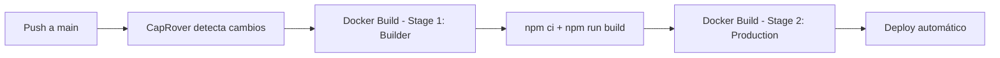

# Operations — DocForge

## Deploy

### Pipeline CI/CD

DocForge se despliega mediante CapRover, que construye la imagen Docker automáticamente al hacer push al repositorio conectado. El Dockerfile usa un build multi-stage para optimizar el tamaño de la imagen de producción.



### Deploy Manual

Si necesitas desplegar manualmente sin CapRover, puedes construir y ejecutar la imagen Docker directamente:

```sh
# Construir la imagen
docker build -t docforge:latest .

# Ejecutar el contenedor
docker run -d \
  --name docforge \
  -p 4400:4400 \
  -e PORT=4400 \
  -e CRYPTO_KEY=<tu_clave_secreta> \
  docforge:latest
```

Para deploy sin Docker:

```sh
npm install
npm run build
NODE_ENV=production node dist/src/main
```

## Variables de Entorno

| Variable | Requerida | Descripción | Ejemplo |
|---|---|---|---|
| `PORT` | ✅ | Puerto TCP en el que escucha el servicio HTTP | `4400` |
| `CRYPTO_KEY` | ✅ | Clave secreta para cifrado/descifrado AES de rutas de archivos PDF temporales | `MiClaveSecretaSegura2026` |
| `NODE_ENV` | ❌ | Entorno de ejecución. CapRover lo establece en `production` automáticamente | `production` |

## Monitoreo

| Métrica | Dashboard | Umbral de Alerta |
|---|---|---|
| Uso de disco en `pdfs/bills/` | Monitoreo del host / CapRover | Alertar si el directorio supera 500 MB (indica que la limpieza automática de archivos no está funcionando) |
| Tiempo de respuesta de `/api/generate/pdf` | Logs del servidor / CapRover | Alertar si supera 10 segundos (puede indicar problemas con la API externa numerosaletras.com) |
| Disponibilidad del servicio | CapRover health check | Alertar si el endpoint raíz (`GET /`) no responde con 200 |

## Alertas

| Alerta | Severidad | Causa Probable | Acción |
|---|---|---|---|
| Servicio no responde en puerto 4400 | Alta | El contenedor se detuvo o el proceso Node.js crasheó | Verificar logs del contenedor con `docker logs docforge`. Reiniciar con `docker restart docforge` o re-deploy desde CapRover |
| Error ENOENT en generación de PDF | Alta | Faltan imágenes en `public/img/` (header.png, footer.png, firma) | Verificar que el directorio `public/` se copió correctamente en el build Docker. Revisar el Dockerfile |
| Timeout en conversión de monto a letras | Media | La API externa `numerosaletras.com` no responde | Verificar conectividad de red del contenedor. Si persiste, considerar implementar la conversión localmente |
| Acumulación de archivos PDF en disco | Media | El `setTimeout` para eliminación de archivos no se ejecutó (proceso reiniciado antes del timeout) | Limpiar manualmente el directorio `pdfs/bills/` y verificar que los timeouts de eliminación están funcionando |

## Rollback

```sh
# 1. Identificar la versión anterior en CapRover
#    Ir a CapRover > Apps > docforge > Deployment

# 2. Si se usa Docker directamente, reconstruir con el commit anterior
git checkout <commit-anterior>
docker build -t docforge:rollback .

# 3. Detener el contenedor actual
docker stop docforge
docker rm docforge

# 4. Levantar la versión anterior
docker run -d \
  --name docforge \
  -p 4400:4400 \
  -e PORT=4400 \
  -e CRYPTO_KEY=<misma_clave> \
  docforge:rollback

# 5. Verificar que el servicio responde
curl http://localhost:4400

# 6. Verificar generación de PDF
curl -X POST http://localhost:4400/api/generate/pdf \
  -H "Content-Type: application/json" \
  -d '{"templateId":"t0000002199","documentData":{"documentId":"ROLLBACK-TEST","date":"test","client":{"name":"Test","docType":"CC","docNumber":"123"},"creditor":{"name":"Test","docType":"CC","docNumber":"456"},"amount":"1.000","items":[{"description":"Test"}],"signature":"test"}}' \
  --output rollback-test.pdf
```

## Incidentes Comunes

| Incidente | Síntoma | Runbook |
|---|---|---|
| PDFs no se generan | El endpoint `/api/generate/pdf` retorna 400 o timeout | 1. Revisar logs del contenedor. 2. Verificar que las imágenes en `public/img/` existen. 3. Probar con un templateId válido. 4. Verificar conectividad a `numerosaletras.com` |
| Links de descarga no funcionan | El endpoint `/api/generate/download/:path` retorna 404 o 400 | 1. Verificar que `CRYPTO_KEY` no cambió entre deploys. 2. Verificar que el archivo no expiró (revisar `docTimeOut`). 3. Comprobar que el directorio `pdfs/bills/` tiene permisos de escritura |
| Disco lleno en producción | El contenedor se queda sin espacio y falla al escribir PDFs | 1. Listar archivos en `pdfs/bills/` dentro del contenedor. 2. Eliminar archivos huérfanos manualmente. 3. Reiniciar el servicio para restablecer los timers de limpieza |
